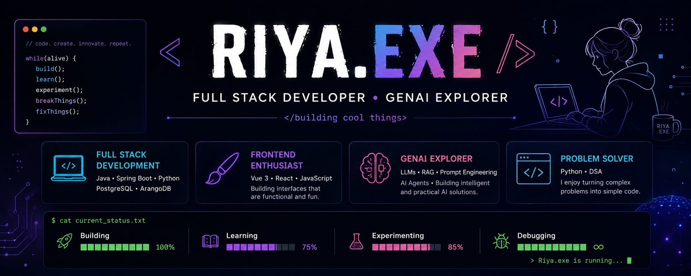

<!--
  Hi! Welcome to my little corner of GitHub. 👋
-->

<div align="center">



<br/>

### `</building cool things>`

**Full Stack Developer · Frontend Enthusiast · GenAI Explorer**

I build full-stack applications, enjoy creating polished and fun frontend experiences,
and love experimenting with AI-powered ideas that can become genuinely useful products.

[](https://www.linkedin.com/in/riya-ranjan-2022k4268/)
[](mailto:ranjanriya01@gmail.com)

</div>

---

## 💫 A little about me

```text
$ whoami

Riya — Software Engineer

→ Full Stack development
→ Frontend & UI enthusiast
→ GenAI / LLM explorer
→ Python + DSA problem solver
→ Currently exploring mobile app development
```

I enjoy working across the stack — from designing interfaces and building frontend
experiences to developing APIs, working with databases, and experimenting with
AI-powered features.

I especially enjoy the part where a technically correct application becomes
something that is also **simple, intuitive and fun to use.** 🎨

---

## 🧩 What I build

| 🛠️ Area | 🔍 What I enjoy |
|---|---|
| **Full Stack** | Building applications across frontend, backend, APIs and databases |
| **Frontend** | Creating clean, interactive and enjoyable user experiences |
| **GenAI** | Exploring LLMs, RAG, prompt engineering and AI-powered applications |
| **Problem Solving** | Python, DSA and breaking complex problems into smaller pieces |
| **Experimentation** | Turning random ideas into small projects just to see if they work 😌 |

---

## 🎨 My frontend side

I genuinely enjoy frontend development — especially the little details that make an
application feel polished.

```text
function buildUI() {
    makeItUseful();
    makeItClean();
    addA littleFun();
    obsessOverSpacing();
    shipIt();
}
```

**Frontend:** `Vue 3` · `React` · `JavaScript` · `PrimeVue`

---

## 🤖 My GenAI side

I'm interested in building AI features that go beyond simply putting a chatbot
on a page.

**Exploring & working with:**

`LLMs` · `RAG` · `Prompt Engineering` · `AI Agents` · `Embeddings` · `Text Chunking` · `Retrieval`

My focus is on understanding how these pieces can be combined into practical,
useful applications.

---

## 🛠️ Tech Stack

### Languages & Core
`Java` · `Python` · `JavaScript` · `DSA`

### Frontend
`Vue 3` · `React` · `PrimeVue`

### Backend
`Spring Boot` · `REST APIs`

### Databases
`PostgreSQL` · `ArangoDB`

### AI / GenAI
`LLMs` · `RAG` · `Prompt Engineering` · `AI Agents` · `Embeddings`

### Tools & Practices
`Git` · `Agile` · `Azure`

---

## 🚀 Things I've built

Here are some of the kinds of things you'll find in my repositories:

- 🖥️ **Full Stack Applications** — frontend + backend + database
- 🎨 **Frontend Experiments** — UI ideas, interactions and reusable components
- 🤖 **GenAI Projects** — LLM, RAG and AI-agent experiments
- 🐍 **Python & DSA** — problem solving and algorithm practice
- 🧪 **Side Projects** — because sometimes you just have to build the idea

> More projects coming as I turn more "what if I build this?" ideas into code. 👀

---

## 📚 Currently exploring

📱 **Mobile App Development**

I'm expanding beyond web development and exploring the world of mobile applications.

At the same time, I'm continuing to experiment with **GenAI and AI-powered
application development.**

---

## 📊 GitHub

<div align="center">


<br/><br/>


</div>

---

## 🌱 A few things about me

```text
💻 I like building things
🎨 I care about how they look and feel
🤖 I'm fascinated by what AI can do
🧠 I enjoy solving problems
📱 I'm currently exploring mobile development
☕ And yes... debugging is part of the personality
```

---

## 🌐 Let's connect

I'm always happy to talk about software, frontend development, GenAI,
interesting projects, or just a cool idea someone wants to build.

<div align="center">

**[LinkedIn](https://www.linkedin.com/in/riya-ranjan-2022k4268/) · [Email](mailto:ranjanriya01@gmail.com)**

<br/><br/>

```text
> Riya.exe is running...

Building       ████████████████████  100%
Learning       ███████████████░░░░░   75%
Experimenting  █████████████████░░░   85%
Debugging      ████████████████████    ∞
```

### `build() • learn() • experiment() • repeat()`

</div>
